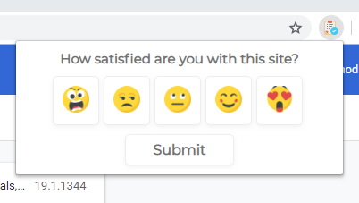

# rate-a-website

Extension part of a small side project. Code for the web app can be found [here](https://github.com/Pav0l/rate-a-website-app) and a deployed app with rating of the world's happiests websites [here](https://happiest-websites.netlify.com/).

# Overview

rate-a-website is a browser extension that allows its users to share their happiness with a website/service/product.
It will be presented to the user in extensions toolbar via an icon.

When the user clicks the icon, a popup will show with a 1-5 `radio` buttons and a submit `button` which will send the rating to the back end.

**Final design:**

## Technical information

The extension is build with vanilla JavaScript, HTML and CSS. Event listener is listening for click events on the submit button and then reading the selected value from DOM nodes.

The HTTP request sent via the Fetch API from the extension will contain information on:

1. Website being rated (`req.body`)
2. Rating of the website (`req.body`)
3. Some identification of the user (IP, ...) to prevent spam (`req.ip`)

A server will process this request, calculates new average rating for rated website and pushes the result to a web app.

A web app will show a leaderboard of ratings.

## Deployed extension

🦊**Firefox:** [rate-a-website](https://addons.mozilla.org/en-US/firefox/addon/rate-a-website/)

**Chrome:** [rate-a-website](https://chrome.google.com/webstore/detail/rate-a-website/oplipkhodadjellpakfommojjmcikidf)
